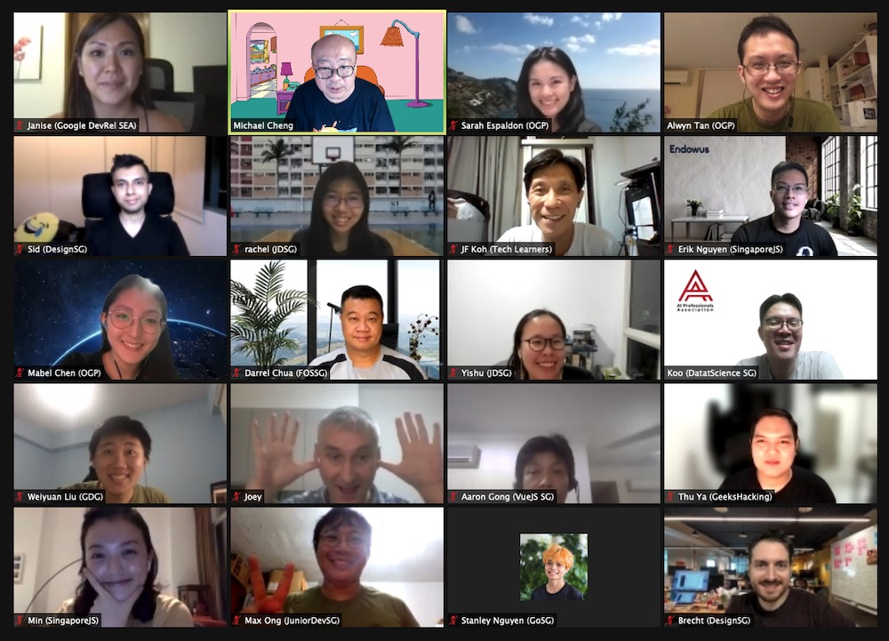

## Tech Community Leaders Retrospective (July 2021)

## Start Doing

Item | Votes
---- | -----
Figure how a subscription can be shared amongst the community | 6
Start a Telegram group for tech community leaders (the Auld Lang Syne approach) | 4
Face to face kopi sessions amongst the various meetup organizers | 4
"Avenger"-class collab event (like IWD)? Maybe the next one could be a national day variant or we create a day for local organizers? | 4
Enable people to discover common interests when joining an event and group them together to chit chat before/after event | 4
Have a common calendar or space where we can more easily propose combined meetups. | 4
Using a platform as a persistent virtual space for the community, then holding events as and when? eg gather.town | 3
Use Telegram Scheduled Voice/Video chat features more often for the telegram-native audience | 3
Having more cross-community events! | 3
Consider starting 30 min before actual time, then push people to breakout rooms to talk? Call everyone together when time to start | 2
Sharing ideas for audience engagement tactics that mimics the serendipity of meeting new people at in-person metups | 2
Finding ways to induct in newcomers to the community | 2
Need to build and maintain directory of all the SG Tech Groups on a non-proprietary  platform | 1
Engage and learn from other community leaders so that we can grow and succeed together. | 1
Sharing our resources and format/organisational overheads | 0
Curating topics for talks | 0
Using a discussion platform that allows involved discussion eg. Zulip | 0
If you don't have a good agenda or speakers, it is ok to skip this month's event. | 0
Make use of the medium better, encouraging creative prerecorded talks (eg. walking and talking through a park) | 0
Ask for help but only in a trusted private group. Like this group. | 0
Maybe a bi-weekly newsletter or something to share on the latest events that is upcoming? | 0
Using background music when people is waiting | 0
Engage your audience during event (type your answers in chat, swags for asking Q&A or providing feedback) | 0
Cross share event announcements if it is relevant. | 0
unconferernce where people can chit chat without much agenda | 0
Consider use of VirtualYard or gather.town to facilitate larger virtual events | 0
Try out regional meetup: combined effort with bigger speaker / topic pool | 0
Post event discussions | 0
virtual kopi.js please | 0
Try out lean coffee / open space virtually | 0
Host larger events together to tap on multiple communities | 0
Understand your audience demographic and behaviour and cater your content to their interest (e.g. content type, tech coverage, talk duration) | 0
Have more natural meetups online, whereby chit chat opportunity is available. Compared to "viewing" only | 0

## Stop Doing

Item | Votes
---- | -----
Conducting webinars that are too long :( people get bored quickly when sessions are too long | 6
Ignoring Discord. | 3
Leaning in on Zoom Q&A as the only means of participation from audience | 2
Prioritising size of the talks over thoughtfulness of interactions/quality of community development | 2
Facebook community is quite dead | 2
One direction flow of information only sessions (eg. only speakers speaking and participants listen passively) | 1
Things that can be pre-recorded and watched in your own time | 1
salesy intro | 0
letting a few speakers dominate whole conversations | 0
Events with lack of speaker diversity (gender, race, topic) | 0
Facebook usage seems to be on decline | 0
Some topic that you can just google for | 1
Cannot keep up with new platforms that popping up | 1
Long form content. Virtual event attention span is short. | 0
The lecture style | 0

## Continue Doing

Item | Votes
---- | -----
Using Engineers.SG website as a one-stop platform where ppl can come to find out upcoming events, links to recorded videos and livestreams, list of tech groups, way to contact tech group organizers. | 13
Sharing upcomng events among groups | 2
Engaging asynchronously with communities via text on Telegram | 2
Having online quiz e.g. Kahoot comprising speakers' and general questions before wrapping up meetup works well generally | 0
Surveying participants to learn how to improve the meetup for them | 0
Sharing recordings of events to let people catch up later on | 0
Free chat time at the start of events to allow free form chit chat and interaction | 0
Asking what our communities want to see, and filling that need | 0
Using tools that encourage interactions between meetup goers eg. online town, gather | 0
Collaborating with more community leaders. :) | 3
Breakout rooms before & after talks | 0
Prepare to market events earlier. Live events that are setup earlier, usually more successful in marketing side (> 2 weeks) and have more participants. | 0
Keep trying to keep the community alive despite covid times. Once died, hard to revive. | 1
Organising community events. Dont let the pandemic stop us! | 0
Pre-event questionnaires seem to help guide discussions during the event itself! | 0
