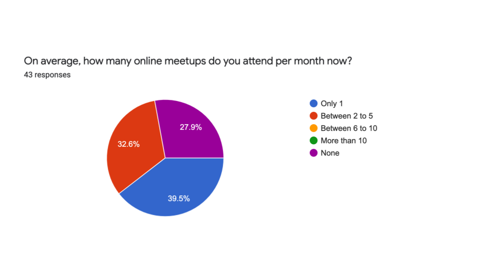
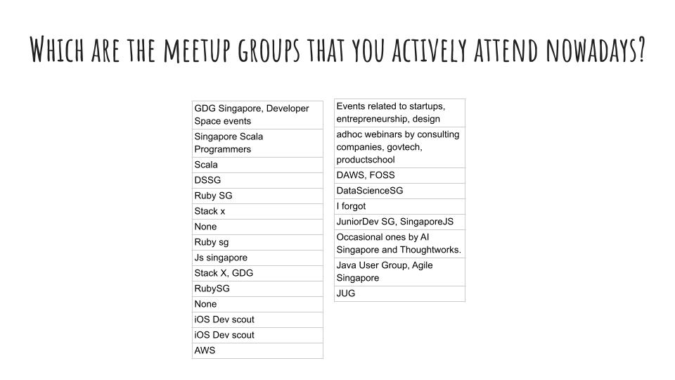
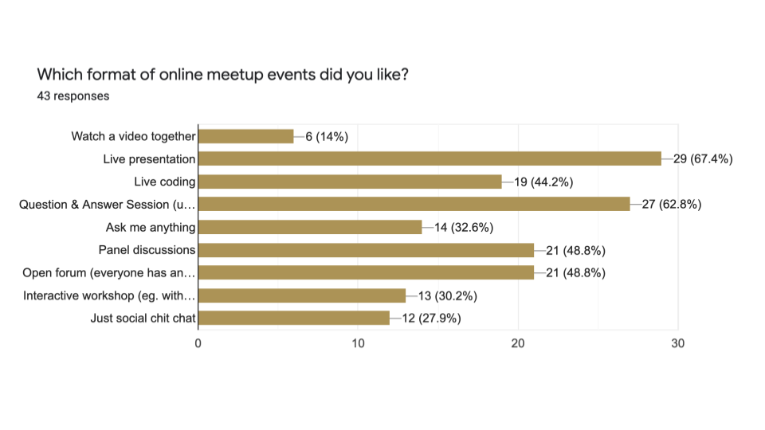
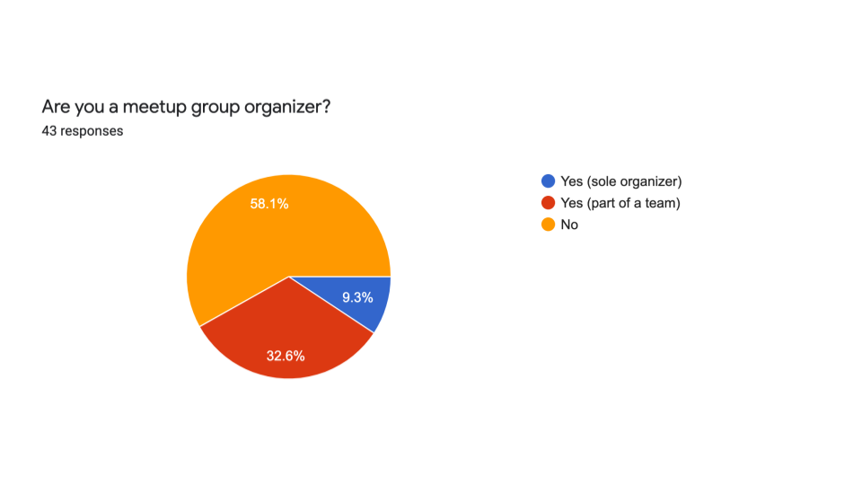
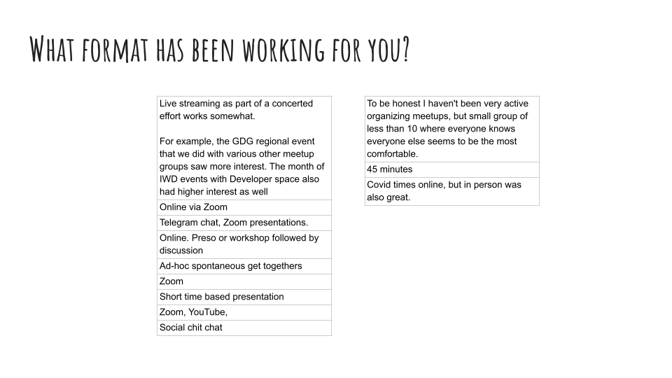
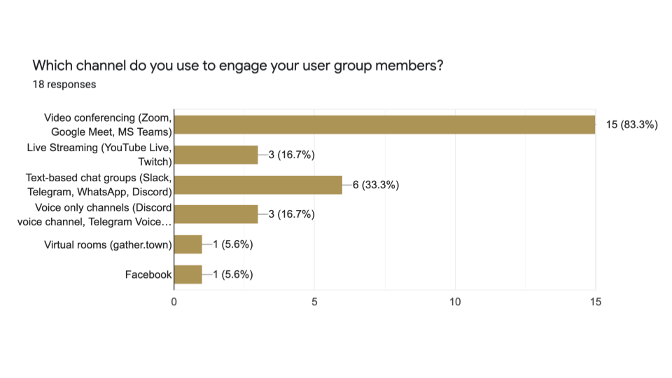
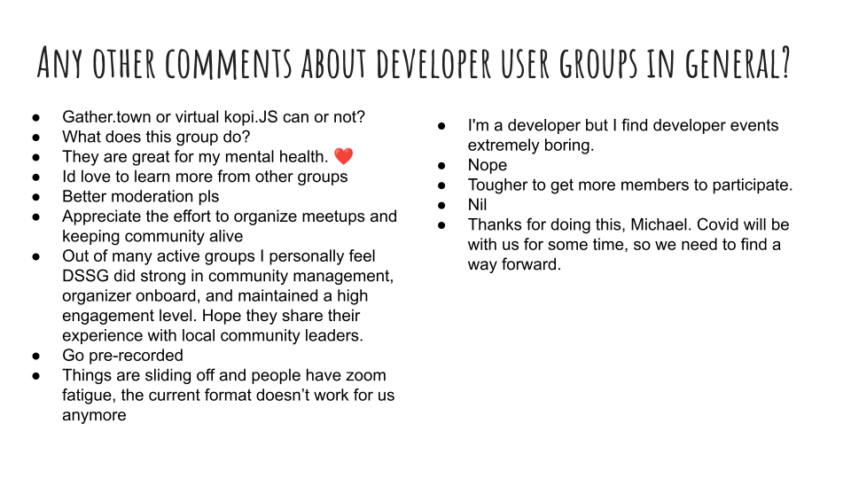

# Developer User Groups Engagement Survey (Singapore) (May 2021)

## Introduction

Given these unprecedented times, it has been a challenge to continue running user group meetups. This survey aims to find out what has been working, what to avoid and how we can do better. Your response will help meetup groups better organise themselves to engage you, the target audience. I will be sharing this with the meetup group organizers (and you can also request a copy of the survey results).

If you have any questions about this survey, you can contact me on Twitter: @coderkungfu. Or email me at: mcheng dot work at gmail dot com

-- Michael Cheng

The [survey form](https://docs.google.com/forms/d/e/1FAIpQLSfh3x0aSKx-5siyC4yE_aKeUHOQchSf6-jyWbwVFfRdItvmBw/viewform?usp=sf_link) is online.

## Results

### Question 5: What did you like about the meetup group events you have attended so far?

- The interaction after the talks
- Discussions
- Able to learn and share/ask questions about the talk/workshop live
- Planning the speakers
- Online Meetups are quite convenient, can join from anywhere.
- Common topic
- Q&A, diversity
- Get to know people
- Physical presence and interaction
- Talking to people
- To be coding together, not just “sit and watch.”
- Content and interactions
- People I know
- Community
- Friendly people like you, Michael! Learn something about technologies that I care about.
- Useful information. Online meetups are also convenient to attend.
- Less attendees, smaller groups with regular attendees make it easier to make personal connections than in person meet up
- i didn't like any of them and stopped attending altogether
- Learning through interaction
- Social aspect
- Quality content
- Seeing people's faces on camera.
- Collaboration, participation, facilitation
- Real info
- Sit and watch. Easier to get new knowledge.
- knowledge and experience sharing, case studies

### Question 6: What did you NOT like about the meetup group events you have attended so far?

- Puzzle games, zoomba
- People tend to be too shy to speak up
- Sometimes the session is too long, more than 1hr... prefer shorter session with a bit of time to interact/social chats
- Planning the speakers
- Nothing beats in person Meetups.
- Quiet after a while
- People turned off camera and lack of engagement
- Vendor sponsor talk
- Seminar style
- Lack of interaction among attendees
- If the presenter went too fast
- Too many dominant speakers or just one person
- Feel distance from the presenter
- Presentations seem a bit unengaging / boring / too long
- Most participants at tech meetups are quite distant and not interested to socialize.
- Harder to interact with speakers and other attendees
- too many people with a few dominating people, no opportunities to connect with others spontaneously as with in-person meetups
- Nothing
- Things that can be watched later
- No audience engagement
- Promotion….
- Lots of time eating sub activities
- people are shy to interact. It's harder than in a face to face environment
- not targeted (since audience group can be big) and hence irrelevant and wasting time.

### Question 7: Do you have any ideas on how we can improve or do differently?

- Need to have a more active asynchronous forum
- Consolidate user group meeting of the same languages eg. Across region or across relevant and complementary languages. Have mix of talk and workshops from - diverse presenters
- Pre-recorded videos if the session doesnt need live interactions
- Have time for social or games or just to talk about how folks are going abt their lives now and help each other out
- More informal chats.
- It takes a person to keep feeding into the group; needs to be sustainable.
- For smaller group, throw an ice breaking question to warm people up and start engagement before the talk.
- More cross-community crossover talks tied by a common quarterly theme (think of it more like TV-series in DC-universe have crossover episodes once a year)
- Still looking for ideas too
- There seem to be fewer meetups these days. Consider have a series of meetups for a topic like 3-parts how to build a xxx
- Pre-record, shorter, more discussion
- Maybe it's possible for participants to open rooms with topics for others to join and talk. And anyone can switch rooms as they need?
- more federation probably- it's only possible to build meaningful connections in smaller groups
- Keep online option for those unable to be present
- Just come together online to discuss things (social), don't need to do things together that can be done async like watching a video
- 🤷🏻‍♂️
- Good question 😂 workshop jug ?
- It's good already
- I've attended an awesome conference called "wild card conference". They used Remo, which allows to have a virtual break room in which people can interact - before the talks. It worked well.
- perhaps be more targeted and short (within 1h).

